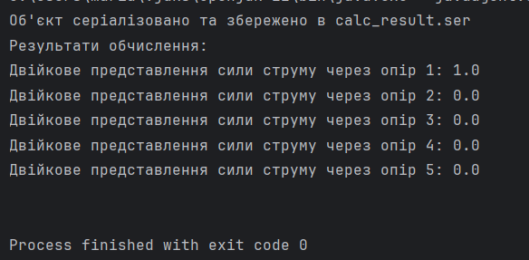

# Практика ООП

### Завдання 1 (29.03.24)
1. Підготувати сховище до розміщення проекту
2. Написати просту консольну програму (наприклад вивід на екран аргументів командної строки)
3. Прикріпити посилання на GIT та архівований проект

- Результати:

### Завдання 2 (1.04.24)
1. Розробити клас, що серіалізується, для зберігання параметрів і результатів
   обчислень.
   Використовуючи агрегування, розробити клас для знаходження рішення
   задачі.

[SerializableClass.java](src/task2/SerializableClass.java)

2. Розробити клас для демонстрації в діалоговому режимі збереження та
   відновлення стану об'єкта, використовуючи серіалізацію. Показати особливості
   використання transient полів.

[DeserealizationDemo.java](src/task2/DeserealizationDemo.java)

3. Розробити клас для тестування коректності результатів обчислень та
   серіалізації/десеріалізації.

[MainTest.java](Test/MainTest.java)

4. Виконати індивідуальне завдання згідно номеру в списку.

   Визначити двійкове подання цілісного значення постійного струму, що
   протікає через кожен із чотирьох паралельно підключених опорів та заданій
   напрузі.

- Результати:

### Завдання 3 (2.04.24)
1. Як основа використовувати вихідний текст проекту попередньої лабораторної роботи. Забезпечити розміщення результатів обчислень уколекції з можливістю збереження/відновлення.
2. Використовуючи шаблон проектування Factory Method (Virtual Constructor), розробити ієрархію, що передбачає розширення рахунок додавання
   нових відображуваних класів.
3. Розширити ієрархію інтерфейсом "фабрикованих" об'єктів, що представляє набір методів для відображення результатів обчислень.
4. Реалізувати ці методи виведення результатів у текстовому виде.
5. Розробити та реалізувати інтерфейс для "фабрикуючого" методу.

[Main.java](src/task3/Main.java)

[View.java](src/task3/View.java)

[Viewable.java](src/task3/Viewable.java)

[ViewableResult.java](src/task3/ViewableResult.java)

[ViewResult.java](src/task3/ViewResult.java)

- Результати:

### Завдання 4 (3.04.24)
1. За основу використовувати вихідний текст проекту попередньої лабораторної роботи Використовуючи шаблон проектування Factory Method
(Virtual Constructor), розширити ієрархію похідними класами, реалізують методи для подання результатів у вигляді текстової
таблиці. Параметри відображення таблиці мають визначатися користувачем.
2. Продемонструвати заміщення (перевизначення, overriding), поєднання (перевантаження, overloading), динамічне призначення методів
(Пізнє зв'язування, поліморфізм, dynamic method dispatch).
3. Забезпечити діалоговий інтерфейс із користувачем.
4. Розробити клас для тестування основної функціональності.

[Main.java](src/task4/Main.java) 

[ViewTable.java](src/task4/ViewTable.java) 

[ViewableTable.java](src/task4/ViewableTable.java) 

[MainTest](Test/MainTest.java)

5. Використати коментарі для автоматичної генерації документації засобами javadoc.

- Результати:

### Завдання 5 (4.04.24)
1. Реалізувати можливість скасування (undo) операцій (команд).
2. Продемонструвати поняття "макрокоманда"
3. При розробці програми використовувати шаблон Singletone.
4. Забезпечити діалоговий інтерфейс із користувачем.
5. Розробити клас для тестування функціональності програми.

[Application](src/task5/Application.java)

[ChangeConsoleCommand](src/task5/ChangeConsoleCommand.java)

[ChangeItemCommand](src/task5/ChangeItemCommand.java)

[Command](src/task5/Command.java)

[ConsoleCommand](src/task5/ConsoleCommand.java)

[GenerateConsoleCommand](src/task5/GenerateConsoleCommand.java)

[Main](src/task5/Main.java)

[Menu](src/task5/Menu.java)

[RestoreConsoleCommand](src/task5/RestoreConsoleCommand.java)

[SaveConsoleCommand](src/task5/SaveConsoleCommand.java)

[UndoConsoleCommand](src/task5/UndoConsoleCommand.java)

[UndoReserve](src/task5/UndoReserve.java)

[ViewConsoleCommand](src/task5/ViewConsoleCommand.java)

- Результати:

